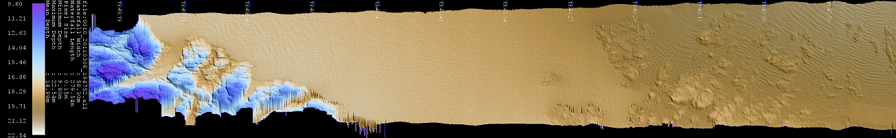

pyAllHillShadedWaterfall
=====
* created:       August 2016
* by:            p.kennedy@fugro.com
* description:   python module to convert a Kongsberg .all file into hillshaded waterfall PNG.
* notes:         See main at end of script for example how to use this
* based on ALL file version 
* version 1.10
* developed for Python version 3.4 

Done
====
* fixed calculationof distance travelled.  it now uses only the first positioning system.  this removes artificial stretch
* if very few samples, auto zoom to improve image quality
* we need to automate a decent shadescale factor.  Here are some numbers to estimate that
* add color legend to bottom left of plot
* add dX scale to left edge of plot.
* add dy scale to bottom left of plot
* check rotated image so we know the survey direction is L-->Read
* figure out why no annotation on Merlin dataset in 8m water
* test with EM302 units.
* hide NaN warning when masking in numpy
* sorted out the poor color interpolation when applying a palette to the depths.  We no longer see contouring at color boundary
* moved zoom ratio to command line arguments
* patch pyall for corrupt X packets which have NaN instead of valid depths
* improved color mapping by settting the colormap to the actual data extents rather than the interp extents.
* add timestamp annotation and ticks burned into the image
* some files are not as roll stabilised as they might be.  If the user uses equi-angular mode, the Dx values are not suitable for aligning on a per pixel basis.  It simply does nopt work well.  Try the Deakin EM2040 data ona small boat in 50m water as an example.  Therefore we need to take the ping and use numpy to interpolate across the ping so things line up 
* sort out crash with very small .all files.
* add support for iso stretching by computing the mean pixel spacing in along and across track axes.  We can then stretch the waterfall to approximate isometry
* handle empty all files elegantly
* improved D reader as we were missing 1 field (maxBeams)
* add option for -gray scale instead of color depth
* add option to rotate the image.  While we call this a waterfall, screens are usually wider than tall, so rotating through 90 makes a lot of sense
* add support for shade scale factor
* add a better palette than the off-the-shelf 'blues' from matplotlib so we see familiar colors
* Waterfall images of an EM2040 look very nice indeed.
* added color depth to the resulting imagery so we see both shaded relief and depth in a single image. 
* implemented generation of a shaded relief image with numpy by computing matrix of orthogonal and transverse slopes, rotating them into the desirder sun angle.
* greyscale images look very handy
* Tested X reader by making a waterfall image.  Results look good


2Do
===
* fix decode of EM300
* figure out the EM3002 stretch problem
* add option to despike the data using numpy median filter.  Use Pipe as an example / test case 
* add support for dual heads

* Power Curve for shading
* y = 37.978x-0.783
* Depth    SwathWidth   GoodScale
* 5.58,38.15,1.0-1.5, EM2040 justy
* 32, 291,0.5, Deakin
* 35, 210, 0.5, EM2000
* 37,70,0.8, Pipe
* 91, 400, 1.0, EM2040 KM
236 844 0.2-0.3,  EM710 0003_201
1728,8461,0.05, EM302 FugroEquator
2767, 7947,,EM302 FugroEquator
2758,3789,0.05,EM302 Africa
2973,8084, 0.02, em302 eq calcd 
3684,13342, 0.01, EM122

Example
-------

python pyallhillshadedwaterfall.py
python pyallhillshadedwaterfall.py -i <filename.all>  
python pyallhillshadedwaterfall.py -i *.all  

help
----
```
C:\development\python>python c:\development\python\pyAllHillShadedWaterfall\pyAllHillShadedWaterfall.py
usage: pyAllHillShadedWaterfall.py [-h] [-i INPUTFILE] [-s SHADESCALE] [-z ZOOM] [-a] [-r] [-gray]

Read Kongsberg ALL file and create a hill shaded color waterfall image.

optional arguments:
  -h, --help     show this help message and exit
  -i INPUTFILE   -i <ALLfilename> : input ALL filename to image. It can also
                 be a wildcard, e.g. *.all
  -s SHADESCALE  -s <value> : Override Automatic Shade scale factor with this
                 value. A smaller number (0.1) provides less shade that a
                 larger number (10) Range is anything. [Default: 0]
  -z ZOOM        -z <value> : Zoom scale factor. A larger number makes a
                 larger image, and a smaller number (0.5) provides a smaller
                 image, e.g -z 2 makes an image twice the native resolution.
                 [Default: 1.0]
  -a             -a : Annotate the image with timestamps. [Default: True]
  -r             -r : Rotate the resulting waterfall so the image reads from
                 left to right instead of bottom to top. [Default is bottom to
                 top]
  -gray          -gray : Apply a gray scale depth palette to the image instead
                 of a color depth. [Default is False]

```